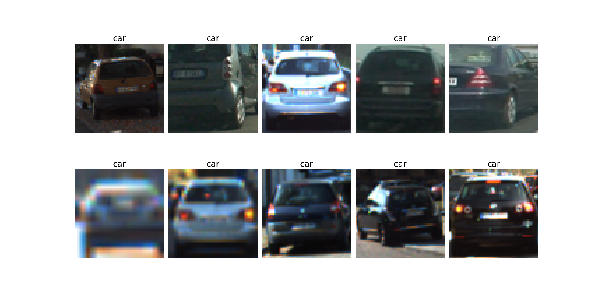
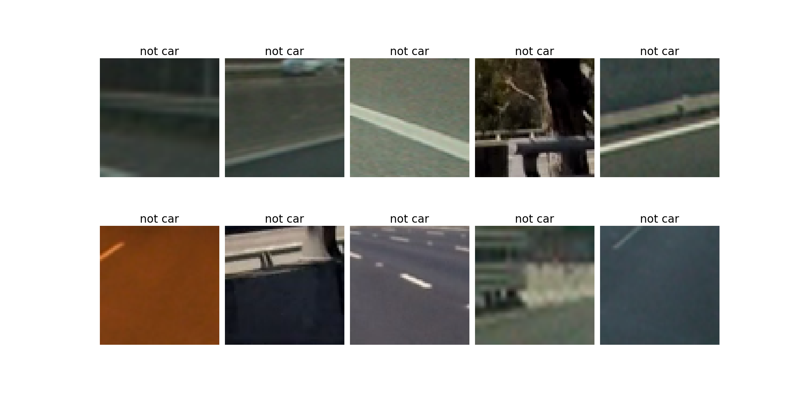
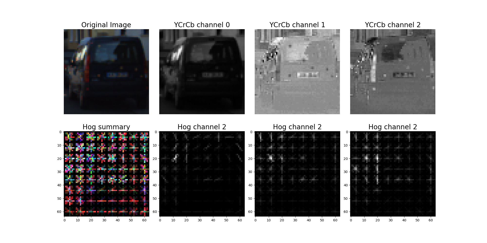
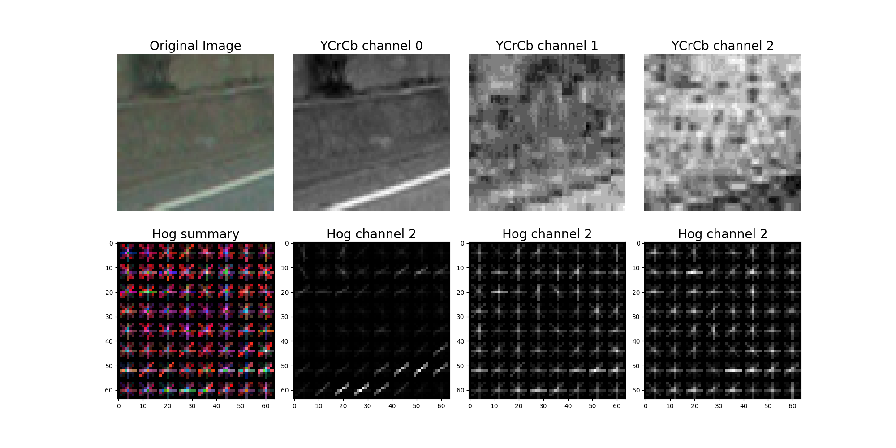
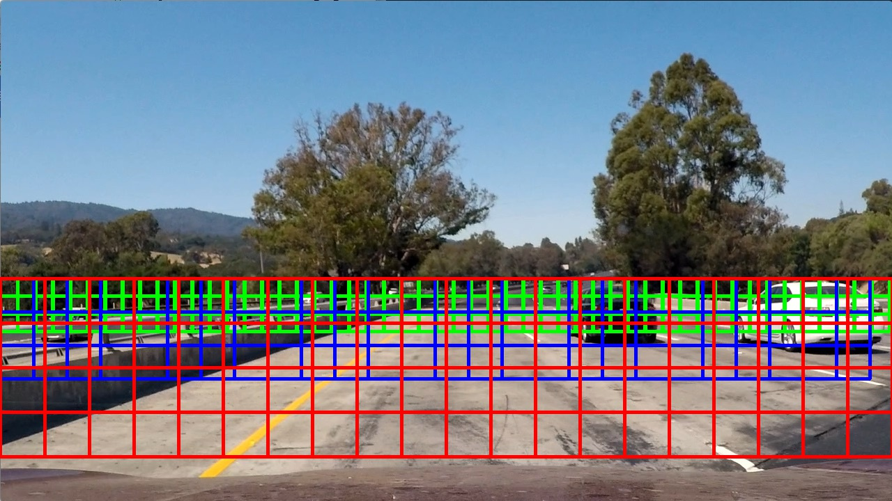
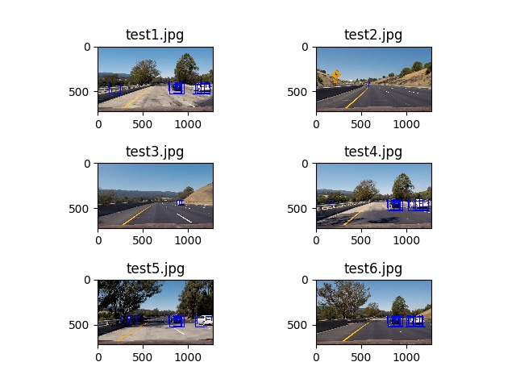
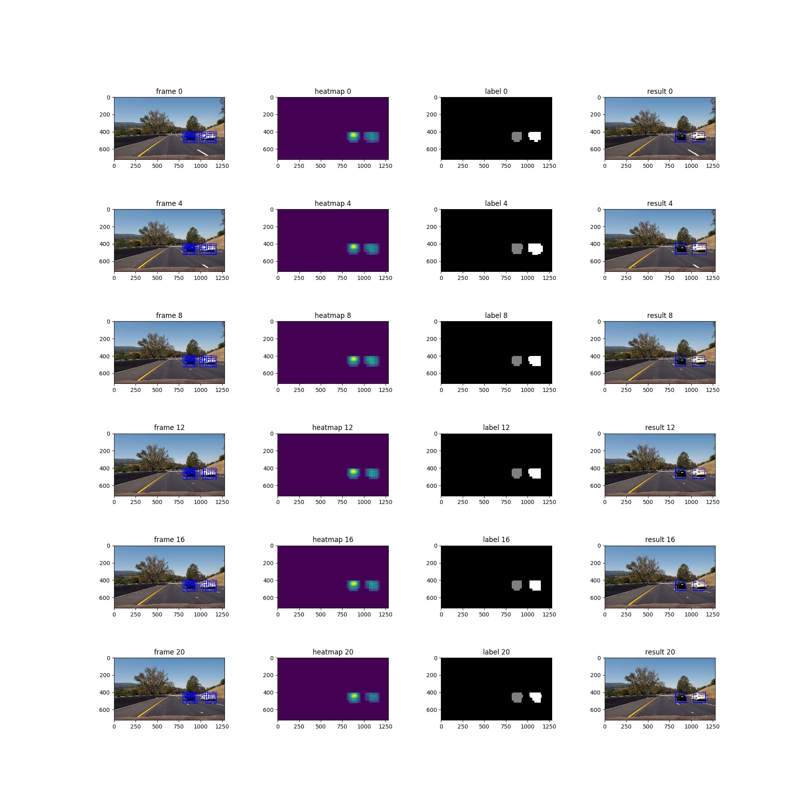

##Writeup Template
###You can use this file as a template for your writeup if you want to submit it as a markdown file, but feel free to use some other method and submit a pdf if you prefer.

---

**Vehicle Detection Project**

The goals / steps of this project are the following:

* Perform a Histogram of Oriented Gradients (HOG) feature extraction on a labeled training set of images and train a classifier Linear SVM classifier
* Optionally, you can also apply a color transform and append binned color features, as well as histograms of color, to your HOG feature vector. 
* Note: for those first two steps don't forget to normalize your features and randomize a selection for training and testing.
* Implement a sliding-window technique and use your trained classifier to search for vehicles in images.
* Run your pipeline on a video stream (start with the test_video.mp4 and later implement on full project_video.mp4) and create a heat map of recurring detections frame by frame to reject outliers and follow detected vehicles.
* Estimate a bounding box for vehicles detected.

[//]: # (Image References)
[image1]: ./examples/car_not_car.png
[image2]: ./examples/HOG_example.jpg
[image3]: ./examples/sliding_windows.jpg
[image4]: ./examples/sliding_window.jpg
[image5]: ./examples/bboxes_and_heat.png
[image6]: ./examples/labels_map.png
[image7]: ./examples/output_bboxes.png
[video1]: ./project_video.mp4

## [Rubric](https://review.udacity.com/#!/rubrics/513/view) Points
###Here I will consider the rubric points individually and describe how I addressed each point in my implementation.  

---
###Writeup / README

####1. Provide a Writeup / README that includes all the rubric points and how you addressed each one.  You can submit your writeup as markdown or pdf.  [Here](https://github.com/udacity/CarND-Vehicle-Detection/blob/master/writeup_template.md) is a template writeup for this project you can use as a guide and a starting point.  

You're reading it!

###Histogram of Oriented Gradients (HOG)

####1. Explain how (and identify where in your code) you extracted HOG features from the training images.

The code for this step is contained in the first code cell of the IPython notebook (or in lines # through # of the file called `some_file.py`).  

I started by reading in all the `vehicle` and `non-vehicle` images.  Here is an example of one of each of the `vehicle` and `non-vehicle` classes:

* vehicles

* non vehicles

I then explored different color spaces and different `skimage.hog()` parameters (`orientations`, `pixels_per_cell`, and `cells_per_block`).  I grabbed random images from each of the two classes and displayed them to get a feel for what the `skimage.hog()` output looks like.

Here is an example using the `YCrCb` color space and HOG parameters of `orientations=8`, `pixels_per_cell=(8, 8)` and `cells_per_block=(2, 2)`:

* Vehicle hog features

* Not vehicle hog features

####2. Explain how you settled on your final choice of HOG parameters.

I tried various combinations of parameters and I got a folling results.
This results were ordered by score(upper is high).
So I choose top score result's parameter.
(The histogram bins was 32 and spatial image size was 32)

| Use Spatial | Use Histogram | Use Hog | Colorspace | Orientations | Pixels Per Cell | Cells Per Block | HOG Channel | Extract Time | Training Time | Score |
| :-----------------: | :-----------------: | :-----------------: | :-----------------: | :-----------------: | :-----------------: | :-----------------: | :-----------------: | :-----------------: | :-----------------: | :-----------------: |
|True|True|True|YCrCb|9|8|2|ALL|57.81|4.22|0.9927|
|True|True|True|YCrCb|11|8|2|ALL|62.66|21.15|0.9927|
|True|True|True|YCrCb|6|8|2|ALL|55.72|12.09|0.9924|
|True|True|True|YCrCb|9|8|2|ALL|59.48|7.41|0.9921|
|True|True|True|YCrCb|7|8|2|ALL|59.42|5.04|0.9921|
|True|True|True|YCrCb|9|8|3|ALL|58.15|5.9|0.9916|
|True|True|True|YCrCb|9|4|2|ALL|151.1|9.4|0.9913|
|True|True|True|YCrCb|12|8|2|ALL|63.95|4.77|0.991|
|True|True|True|YCrCb|9|8|1|ALL|56.83|9.24|0.9907|
|True|True|True|YCrCb|9|8|2|ALL|58.78|17.24|0.9904|
|True|True|True|YCrCb|9|8|2|ALL|64.34|16.7|0.9901|
|True|True|True|YCrCb|9|8|2|ALL|63.8|15.94|0.9899|
|True|True|True|YCrCb|9|8|2|ALL|59.6|4.6|0.9899|
|True|True|True|YCrCb|9|8|2|ALL|63.69|16.23|0.9899|
|True|True|True|YCrCb|9|12|2|ALL|43.33|8.44|0.9893|
|True|True|True|YCrCb|9|8|2|ALL|57.27|3.53|0.989|
|True|True|True|YCrCb|9|8|2|ALL|59.79|3.7|0.989|
|True|True|True|YCrCb|9|16|2|ALL|41.33|6.56|0.9887|
|False|True|True|YCrCb|9|8|2|ALL|68.26|10.18|0.9879|
|True|False|True|YCrCb|9|8|2|ALL|51.1|15.71|0.9868|
|True|True|True|YCrCb|9|8|2|ALL|56.58|18.6|0.9837|
|True|True|True|YCrCb|9|8|2|0|27.63|9.33|0.9837|
|True|True|True|YCrCb|9|8|2|2|27.28|11.71|0.9707|
|True|True|True|YCrCb|9|8|2|1|27.4|10.94|0.9685|
|True|True|False|YCrCb|9|8|2|ALL|17.63|10.95|0.9502|

####3. Describe how (and identify where in your code) you trained a classifier using your selected HOG features (and color features if you used them).

I trained a linear SVM using HOG and spatial intensity and channel intensity histogram features and was able to achive a test accuracy of 99.27% (train.py line 70 through 82).

###Sliding Window Search

####1. Describe how (and identify where in your code) you implemented a sliding window search.  How did you decide what scales to search and how much to overlap windows?

I decided to search window following positions and scales
* scale 0.8 and y_start 400,y_stop 480(blue)
* scale 1.5 and y_start 400,y_stop 556(blue)
* scale 2.0 and y_start 400,y_stop 656(red)
the image and came up with this.

####2. Show some examples of test images to demonstrate how your pipeline is working.  What did you do to optimize the performance of your classifier?

Ultimately I searched on two scales using YCrCb 3-channel HOG features plus spatially binned color and histograms of color in the feature vector, which provided a nice result.  Here are some example images:

---

### Video Implementation

####1. Provide a link to your final video output.  Your pipeline should perform reasonably well on the entire project video (somewhat wobbly or unstable bounding boxes are ok as long as you are identifying the vehicles most of the time with minimal false positives.)
Here's a [link to my video result](./project_out.mp4)

####2. Describe how (and identify where in your code) you implemented some kind of filter for false positives and some method for combining overlapping bounding boxes.

I recorded the positions of positive detections in each frame of the video.  From the positive detections I created a heatmap and then thresholded that map to identify vehicle positions.  I then used `scipy.ndimage.measurements.label()` to identify individual blobs in the heatmap.  I then assumed each blob corresponded to a vehicle.  I constructed bounding boxes to cover the area of each blob detected.  

Here's an example result showing the heatmap from a series of frames of video, the result of `scipy.ndimage.measurements.label()` and the bounding boxes then overlaid on the last frame of video:

### Here are six frames and their corresponding heatmaps,labels and resulting bounding boxes:

---

###Discussion

####1. Briefly discuss any problems / issues you faced in your implementation of this project.  Where will your pipeline likely fail?  What could you do to make it more robust?

I faced the problem of incorrectly detections.
I try some heatmap thresholds to reduce it,but some frame were detected...
So I decided to use previous frame(functions.py line 260),
I set coefficients so that the weight of the previous frame becomes smaller(0.1,0.2,0.3,0.4) and apply thresholds to summalize result.
So I think false positive were mitigated.

